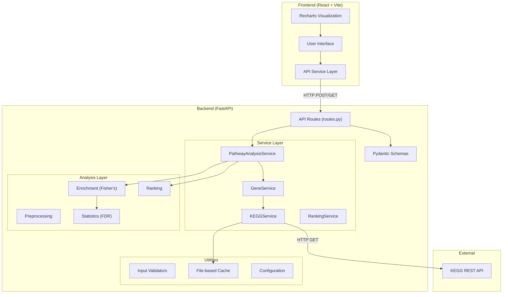
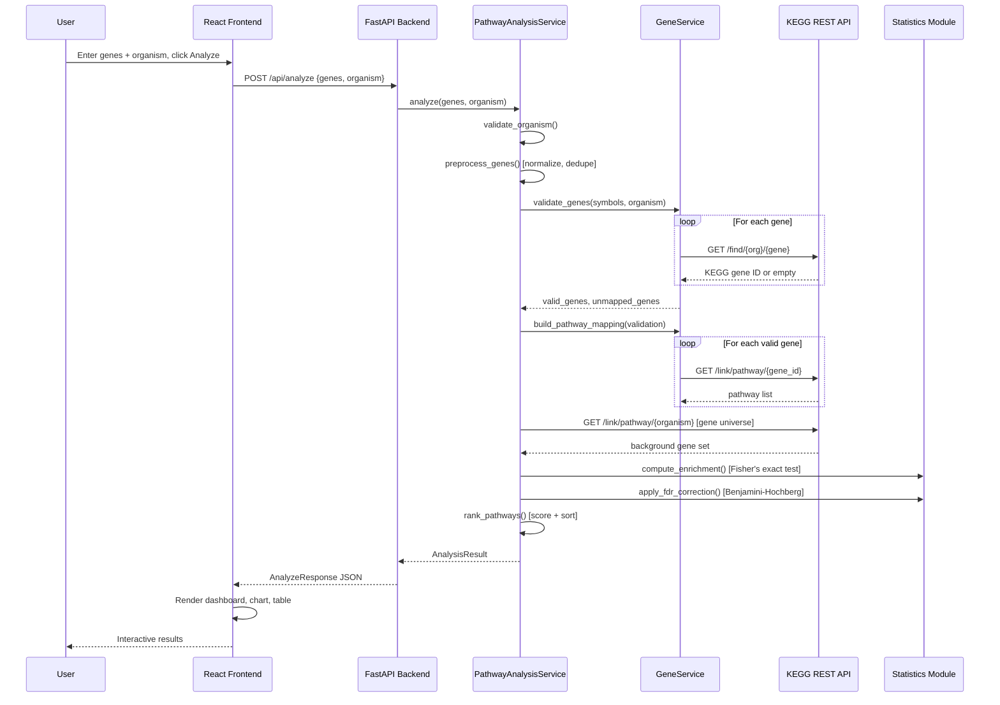

# System Architecture

## Overview

KEGGPathRank follows a clean three-tier architecture: **Frontend (React)** → **Backend (FastAPI)** → **External Data Source (KEGG REST API)**.

## Architecture Diagram

## Request Lifecycle

## Design Decisions

### Why an explicit organism dropdown instead of auto-detection?
Gene symbols are not unique across organisms. For example, "TP53" exists in human, mouse, and rat with different KEGG identifiers. Automatic species detection from bare gene symbols is unreliable because symbols collide across species. An explicit dropdown eliminates ambiguity.

### Why no database?
KEGGPathRank performs stateless analyses. Each request is self-contained: genes go in, results come out. A file-based cache handles KEGG response caching. Adding a database (PostgreSQL, SQLite, etc.) would add deployment complexity without meaningful benefit for this use case.

### Why a separate KEGG service layer?
All KEGG communication is isolated in `kegg_service.py` so that:
1. Tests can substitute a mock with zero network calls.
2. Rate limiting, caching, and retry logic are centralized.
3. If KEGG changes its API, only one file needs updating.

### Why two chart libraries?
- **Recharts** (frontend): Interactive tooltips, click handlers, responsive — ideal for the live web dashboard where users explore results.
- **Matplotlib** (scripts/): Publication-quality raster/vector output — ideal for reports, papers, and offline use where interactivity isn't needed.
